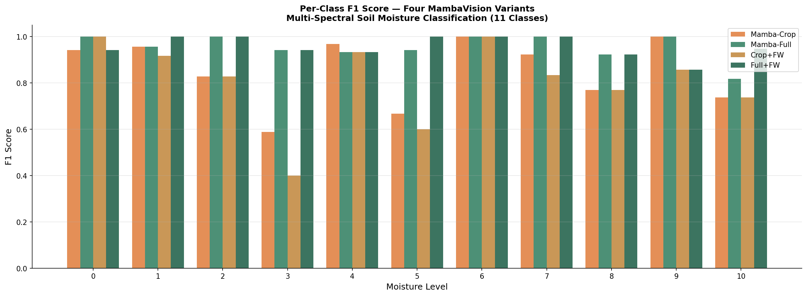
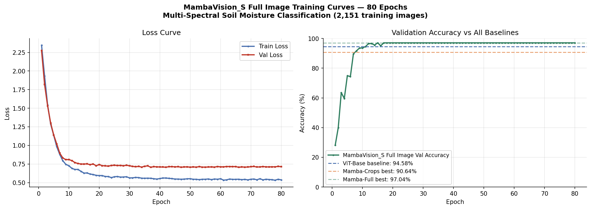
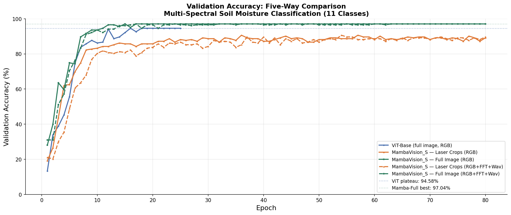
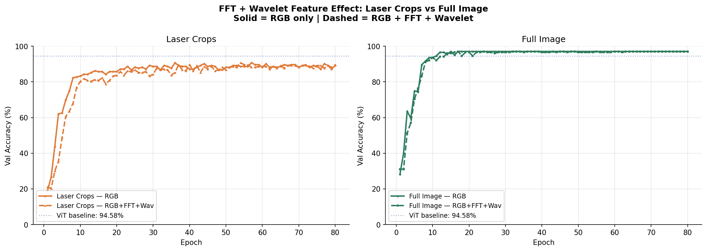
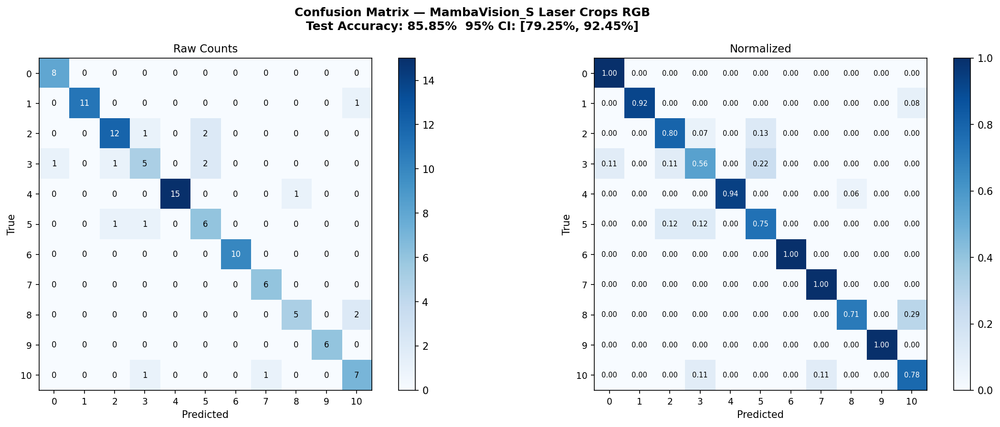
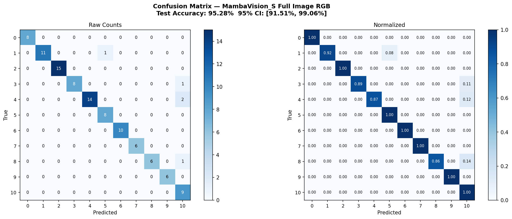
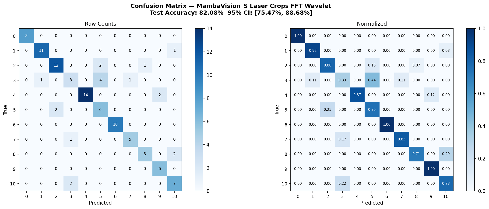

# MambaVision vs ViT: Multi-Spectral Soil Moisture Classification

**MambaVision_S | MTSU Lambda Cluster | RTX 3090 | 11-Class Moisture Classification**

This repository presents a systematic architectural comparison of MambaVision_S against the ViT-Base baseline established in the companion project ([Irrigation-Laser Multi-Spectral Soil Moisture Classification via Vision Transformer and YOLOv8](https://github.com/GraceE-Dion/MambaVision-MultiSpectral-Soil-Analysis)), evaluated on multi-spectral laser soil moisture imagery across five controlled experimental conditions. The work extends the ViT Phase 2 full image pipeline with three original research contributions: a full image MambaVision training regime, a laser crop vs full image input representation ablation, and a Fourier Transform + Wavelet Transform frequency feature integration experiment.

**Research questions tested:**
1. Can MambaVision_S match or exceed ViT-Base accuracy on full multispectral images with fewer parameters?
2. Does input representation (full image vs laser crop) have a larger effect on accuracy than architectural choice?
3. Do frequency-domain features (FFT + Wavelet) provide additive signal beyond RGB, and is that signal input-scale dependent?

---

## Repository Structure

```
├── 02_data_preparation.py                        # Dataset preparation, laser crop extraction
├── 03_baseline_vit_comparison.py                 # ViT baseline result packaging
├── 04_mambavision_backbone.py                    # Backbone load and head verification
├── 05_training.py                                # MambaVision_S — laser crops, RGB
├── 05b_training_fullimage.py                     # MambaVision_S — full image, RGB
├── 05c_training_fft_wavelet.py                   # MambaVision_S — laser crops, RGB+FFT+Wav
├── 05bc_training_fft_wavelet_fullimage.py        # MambaVision_S — full image, RGB+FFT+Wav
├── 06_evaluation.py                              # Laser crops two-way evaluation
├── 06b_evaluation.py                             # Three-way comparison evaluation
├── 06c_evaluation.py                             # Five-way final comparison evaluation
├── 06d_perclass_analysis.py                      # Per-class F1, confusion matrices, bootstrap CIs
├── 07_inference_pipeline.py                      # Laser crops inference — annotated panels
├── 07b_inference_pipeline.py                     # Full image inference — annotated panels
├── 07c_inference_pipeline.py                     # Laser crops + FFT/Wav inference
├── 07bc_inference_pipeline.py                    # Full image + FFT/Wav inference
└── results/
    ├── inference_images/                         # Laser crops inference annotated panels
    ├── inference_images_fullimage/               # Full image inference annotated panels
    ├── inference_images_fft_wavelet/             # Laser crops FFT/Wav inference panels
    ├── inference_images_fft_wavelet_fullimage/   # Full image FFT/Wav inference panels
    ├── fullimage/                                # Full image training results and figures
    ├── fft_wavelet/                              # FFT/Wavelet laser crops results
    ├── fft_wavelet_fullimage/                    # FFT/Wavelet full image results
    └── perclass/                                 # Per-class F1, confusion matrices, bootstrap CIs
```

**Script execution order:** 02 → 03 → 04 → 05 (or 05b/05c/05bc) → 06 (or 06b/06c/06d) → 07 (or 07b/07c/07bc). Scripts 05b, 05c, and 05bc are independent variants of 05 and can be run in any order after 04. Scripts 06b and 06c require all relevant training results to be present in `./results/`. Script 06d requires all four MambaVision model checkpoints.

---

## Background and Motivation

The companion project ([ViT repository](https://github.com/GraceE-Dion/MambaVision-MultiSpectral-Soil-Analysis)) established ViT-Base (`google/vit-base-patch16-224-in21k`, 86M parameters) as the baseline classifier for multi-spectral laser soil moisture classification across 11 discrete moisture levels (0–10), using seven Roboflow datasets spanning standard visible, infrared, and ultraviolet spectral modalities.

**Why ViT Phase 2 is the primary comparison baseline:** Phase 2 (94.58% val accuracy, 25 epochs, full image input, on-the-fly augmentation) is used as the primary comparison point rather than Phase 4B (90.64%, laser crops) or Phase 6 (YOLOv8, 95.3% mAP50) for the following reasons. Phase 2 and the MambaVision full image variants share the same input type (full image), the same task framing (classification), and comparable training conditions, making it the only architecturally equivalent comparison. Phase 4B uses laser crops and is used as the comparison baseline for the MambaVision laser crop variants specifically. Phase 6 (YOLOv8) is a detection pipeline, not a classifier, and is not directly comparable on classification metrics.

This project investigates whether MambaVision_S — a hybrid Mamba-Transformer architecture combining selective state space modeling with transformer attention — can match or exceed ViT Phase 2 performance with fewer parameters and faster convergence. The secondary investigation tests whether frequency-domain features provide additive signal and whether that signal is input-scale dependent.

---

## Datasets

Seven multi-spectral laser datasets sourced from Roboflow, unified into a single 11-class moisture classification corpus:

| Dataset | Spectrum | Focus |
|---|---|---|
| soil-moisture-v4 | Standard visible | Baseline laser reflection patterns |
| soil-moisture-v4-IR | Infrared | Thermal moisture signatures |
| soil-moisture-v4-UV | Ultraviolet | High-contrast mineral/moisture separation |
| soil-moisture-IR | Infrared | Secondary heat-based validation |
| soil-moisture-5sagf | General field | Diverse environmental conditions |
| soil_moisture_september | Temporal (Sept) | Seasonal moisture variation |
| soil_moisture_stir_september | Temporal (Sept) | Stirred soil reflectance |

**Training sets:** Master_Laser_Crops and Master_Soil_Moisture each contain 2,151 images (717 originals + 2x physical augmentation via Gaussian noise and salt-and-pepper noise copies saved to disk). This augmentation is identical to ViT Step 16 augmentation, ensuring the training data expansion is not a confounding variable in the comparison.

**Test set:** 106 images across 11 classes for both crop and full image variants. Class distribution: Level 0 (8), Level 1 (12), Level 2 (15), Level 3 (9), Level 4 (16), Level 5 (8), Level 6 (10), Level 7 (6), Level 8 (7), Level 9 (6), Level 10 (9).

**Known data limitation — Soil-Moisture-5sagf:** No test images were found for this dataset in the laser crops folder across any inference run. This is flagged as a dataset integrity issue: either the dataset was excluded during the test split or its filename convention does not match the detection pattern in the inference scripts. This affects all five model variants equally and is documented here for audit purposes. Future work should investigate whether 5sagf images are present in the test folder under a different naming convention.

---

## Model Architecture

### MambaVision_S (Baseline)

MambaVision_S (~50M parameters) is loaded from the NVlabs fork (`GraceE-Dion/MambaVision`, branch `grace/research-main`) via `sys.path.insert`. The pretrained classification head is replaced with:

```python
model.head = nn.Sequential(
    nn.Dropout(p=0.3),
    nn.Linear(in_features, 11)
)
```

`torch.backends.cudnn.enabled = False` is required on the MTSU Lambda cluster (cuDNN incompatibility with mamba-ssm 2.2.2). timm-based loading does not work and raises an import error — the NVlabs fork must be used via `sys.path.insert`.

### MambaVisionFFTWavelet (FFT + Wavelet Variant)

**Hypothesis tested:** Frequency-domain texture features (FFT magnitude spectrum, Haar wavelet detail sub-bands) carry moisture-discriminative signal not captured by RGB alone, and that signal is extractable via a lightweight input projection.

A `input_proj` Conv2d(7→3, 1×1) layer is prepended to the backbone, projecting 7-channel inputs (3 RGB + 1 FFT + 3 Wavelet) back to 3 channels before the pretrained backbone. Xavier uniform initialization is applied to `input_proj`. Pretrained backbone weights are fully preserved.

```python
class MambaVisionFFTWavelet(nn.Module):
    def __init__(self, num_classes, in_channels=7):
        super().__init__()
        self.input_proj = nn.Conv2d(in_channels, 3, kernel_size=1, bias=False)
        nn.init.xavier_uniform_(self.input_proj.weight)
        self.backbone = models.mamba_vision_S(pretrained=True)
        in_features = self.backbone.head.in_features
        self.backbone.head = nn.Sequential(
            nn.Dropout(p=0.3),
            nn.Linear(in_features, num_classes)
        )

    def forward(self, x):
        x = self.input_proj(x)
        return self.backbone(x)
```

**FFT channel:** 2D FFT magnitude spectrum (log-scaled, normalized) computed from grayscale image. Captures global frequency patterns and periodic texture structure correlated with moisture-induced surface changes.

**Wavelet channels:** Single-level Haar DWT producing three detail sub-bands — horizontal (cH), vertical (cV), and diagonal (cD) — each resized to input spatial dimensions via bilinear interpolation. Captures multi-scale local frequency detail at different orientations.

---

## Training Configuration

**Why these hyperparameters:** AdamW at 2e-5 LR was chosen to match the ViT Phase 2 optimizer exactly, ensuring the comparison is not confounded by optimizer differences. Weight decay 0.01 and Dropout 0.3 mirror ViT Phase 1 regularization settings. Batch size 16 was constrained by RTX 3090 memory with the 7-channel FFT/Wavelet variants. 80 epochs was chosen after the laser crop progression showed convergence between epochs 54–80 — running to 80 ensures no model is stopped before its natural plateau. CosineAnnealingLR with 100 warmup steps was chosen over step decay to allow smoother early-epoch learning given the small dataset size.

| Parameter | Value | Rationale |
|---|---|---|
| Optimizer | AdamW | Matches ViT Phase 2 for controlled comparison |
| Learning rate | 2e-5 | Matches ViT Phase 2 |
| Weight decay | 0.01 | Matches ViT Phase 1 regularization |
| Warmup steps | 100 | Smooth early-epoch learning on small dataset |
| Scheduler | CosineAnnealingLR | Smoother than step decay for small datasets |
| Epochs | 80 | Covers all observed convergence points (15–54) |
| Batch size | 16 | Memory-constrained by 7-channel FFT/Wav variants |
| Loss | CrossEntropyLoss (label smoothing 0.1) | Matches ViT Phase 2 |
| Class weighting | Inverse frequency WeightedRandomSampler | Addresses class imbalance |
| Image size | 224×224 | Standard ViT/MambaVision input size |
| Platform | MTSU Lambda RTX 3090 | |

---

## Architecture Evolution and Training History

### Why MambaVision_T Was Insufficient

Initial training used MambaVision_T (Tiny, 31.16M parameters). The hypothesis was that a lighter model might generalize better on the small 717-image dataset. Two rounds of training showed this hypothesis was incorrect — MambaVision_T lacked the representational capacity for 11-class fine-grained spectral classification.

### Laser Crops Full Progression

| Round | Model | Epochs | Augmentation | Best Val Acc | Decision and Rationale |
|---|---|---|---|---|---|
| 1 | MambaVision_T | 25 | No | 70.94% | Plateau too low — model capacity insufficient for 11-class spectral task |
| 2 | MambaVision_T | 40 | No | 79.80% | Extended training did not resolve capacity ceiling — upgraded to S |
| 3 | MambaVision_S | 40 | No | 82.27% | Significant improvement but plateau with overfitting signs |
| 4 | MambaVision_S | 60 | No | 81.28% | Accuracy dropped — confirmed overfitting without augmentation |
| 5 | MambaVision_S | 60 | Yes (2,151) | 90.15% | Physical augmentation resolved overfitting — critical turning point |
| 6 | MambaVision_S | 80 | Yes (2,151) | **90.64%** | Stable plateau confirmed — final laser crops model |

**Critical finding from this progression:** Physical augmentation (Gaussian noise + salt-and-pepper noise, tripling training set from 717 to 2,151 images) was the decisive factor, not architecture or epoch count. Without augmentation MambaVision_S plateaued at ~82% regardless of training duration. This mirrors the ViT Phase 4A finding where the same augmentation strategy improved ViT laser crop accuracy from 87.68% to 89.66%.

---

## Results

### Five-Way Comparison

| Model | Input | Features | Val Acc | Test Acc | Convergence | GPU Mem |
|---|---|---|---|---|---|---|
| ViT-Base | Full image | RGB | 94.58% | N/A | Epoch 25 | N/A (Kaggle) |
| MambaVision_S | Laser crops | RGB | 90.64% | 85.85% | Epoch 36 | 2.01 GB |
| **MambaVision_S** | **Full image** | **RGB** | **97.04%** | **95.28%** | **Epoch 15** | **2.01 GB** |
| MambaVision_S | Laser crops | RGB+FFT+Wav | 90.64% | 82.08% | Epoch 54 | 2.03 GB |
| MambaVision_S | Full image | RGB+FFT+Wav | 97.04% | 96.23% | Epoch 17 | 2.03 GB |

### MambaVision_S vs ViT-Base (Full Image, Research Question 1)

| Metric | ViT-Base | MambaVision_S | Delta |
|---|---|---|---|
| Val Accuracy | 94.58% | 97.04% | +2.46% |
| Test Accuracy | N/A | 95.28% | — |
| Parameters | 86M | ~50M | -42% |
| Convergence Epoch | 25 | 15 | -40% |
| Inference Latency | N/A | 0.98 ms/image | — |
| Peak GPU Memory | N/A | 2.01 GB | — |

### Bootstrap Confidence Intervals (95%, n=1000)

| Model | Test Accuracy | 95% CI | CI Width |
|---|---|---|---|
| MambaVision_S Laser Crops | 85.85% | [79.25%, 92.45%] | 13.20% |
| MambaVision_S Full Image | 95.28% | [91.51%, 99.06%] | 7.55% |
| Laser Crops + FFT/Wav | 82.08% | [75.47%, 88.68%] | 13.21% |
| Full Image + FFT/Wav | 96.23% | [92.43%, 99.06%] | 6.63% |

The non-overlapping CIs between full image variants ([91.51%, 99.06%]) and laser crop variants ([79.25%, 92.45%]) confirm the full image accuracy advantage is statistically robust and not attributable to sampling variation. The +0.95% FFT/Wavelet gain on full images, while genuine, falls within overlapping CI ranges and should be interpreted as marginal rather than definitive.

### Per-Class F1 Score Comparison

| Class | Support | Mamba-Crop | Mamba-Full | Crop+FW | Full+FW |
|---|---|---|---|---|---|
| Level 0 | 8 | 0.9412 | 1.0000 | 1.0000 | 0.9412 |
| Level 1 | 12 | 0.9565 | 0.9565 | 0.9167 | 1.0000 |
| Level 2 | 15 | 0.8276 | 1.0000 | 0.8276 | 1.0000 |
| Level 3 | 9 | 0.5882 | 0.9412 | 0.4000 | 0.9412 |
| Level 4 | 16 | 0.9677 | 0.9333 | 0.9333 | 0.9333 |
| Level 5 | 8 | 0.6667 | 0.9412 | 0.6000 | 1.0000 |
| Level 6 | 10 | 1.0000 | 1.0000 | 1.0000 | 1.0000 |
| Level 7 | 6 | 0.9231 | 1.0000 | 0.8333 | 1.0000 |
| Level 8 | 7 | 0.7692 | 0.9231 | 0.7692 | 0.9231 |
| Level 9 | 6 | 1.0000 | 1.0000 | 0.8571 | 0.8571 |
| Level 10 | 9 | 0.7368 | 0.8182 | 0.7368 | 0.9474 |
| **Macro Avg** | **106** | **0.8524** | **0.9558** | **0.8068** | **0.9585** |

**Per-class findings:** The +2.46% accuracy gap between Mamba-Crop and Mamba-Full is explained at the class level by Levels 2, 3, 5, 7, and 8 — all mid-range moisture levels where full spatial context resolves ambiguity that crop-scale features cannot. Level 3 shows the most dramatic improvement (0.5882 → 0.9412), suggesting mid-range moisture signatures are spatially distributed across the full image rather than concentrated at the laser spot. Level 10 is the consistently hardest class across all models (0.7368–0.9474), consistent with the ViT Phase 6 per-class mAP50 finding where Level 10 scored 75.9% — the highest moisture level produces the most variable surface appearance. FFT/Wavelet features on laser crops hurt Level 3 most severely (0.5882 → 0.4000), confirming that frequency noise from crop boundary artifacts disproportionately affects the already-ambiguous mid-range levels.



### Per-Dataset Inference Results

| Dataset | Mamba-Crop | Mamba-Full | Crop+FW | Full+FW |
|---|---|---|---|---|
| Soil-Moisture-v4 | 8/8 (100%) | 8/8 (100%) | 5/8 (62.5%) | 8/8 (100%) |
| Soil-Moisture-v4-IR | 7/7 (100%) | 7/7 (100%) | 7/7 (100%) | 7/7 (100%) |
| Soil-Moisture-v4-UV | 7/7 (100%) | 7/7 (100%) | 7/7 (100%) | 7/7 (100%) |
| Soil-Moisture-IR | 7/7 (100%) | 7/7 (100%) | 3/7 (42.86%) | 7/7 (100%) |
| Soil-Moisture-5sagf | 0/0 | 0/0 | 0/0 | 0/0 |
| Soil-Moisture-September | 5/7 (71.43%) | 5/7 (71.43%) | 4/7 (57.14%) | 5/7 (71.43%) |
| Soil-Moisture-Stir-September | 4/5 (80%) | 4/5 (80%) | 0/5 (0%) | 4/5 (80%) |
| **OVERALL** | **38/41 (92.68%)** | **38/41 (92.68%)** | **26/41 (63.41%)** | **38/41 (92.68%)** |

---

## Training Curves and Visualizations

### MambaVision_S Full Image — Training Curves



### Five-Way Accuracy Comparison



### FFT + Wavelet Effect: Laser Crops vs Full Image



### Confusion Matrices








---

## Key Findings

### Finding 1: MambaVision_S Outperforms ViT-Base on Full Images (Research Question 1 — Confirmed)

**Hypothesis:** MambaVision_S can match or exceed ViT-Base accuracy with fewer parameters.
**Result:** Confirmed with margin.

MambaVision_S exceeds the ViT Phase 2 baseline by +2.46% validation accuracy (97.04% vs 94.58%) while using 42% fewer parameters (~50M vs 86M), converging 40% faster (epoch 15 vs epoch 25), and maintaining zero overfitting across 65 subsequent epochs. The model locked at 97.04% from epoch 15 through epoch 80 — val loss continued a mild downward trend (0.7500 at epoch 15 to 0.7130 at epoch 80) while train loss steadily decreased, confirming the model refined internal representations without generalization degradation. Bootstrap CIs [91.51%, 99.06%] confirm this result is statistically robust.

**Governance implication:** The 42% parameter reduction is reported alongside accuracy rather than in isolation. Parameter efficiency claims are only meaningful when accuracy is simultaneously maintained or improved — both conditions are satisfied here. This finding supports responsible deployment decisions where computational constraints exist.

### Finding 2: Input Representation Dominates Architecture Choice (Research Question 2 — Confirmed)

**Hypothesis:** Full image context provides more discriminative signal than laser crop isolation for this task.
**Result:** Confirmed. The effect size is larger than the architectural improvement.

The same MambaVision_S model achieves 97.04% val accuracy on full images versus 90.64% on laser crops — a 6.40% gap from input type alone, using identical model, hardware, and training configuration. This gap is 2.6x larger than the architectural gain over ViT (+2.46%). At the class level, the gap is driven primarily by Levels 2, 3, 5, 7, and 8 — mid-range moisture levels where discriminative features are spatially distributed across the full image rather than concentrated at the laser spot.

**Governance implication:** Pipeline design decisions (crop vs full image) have larger accuracy consequences than architectural selection within this parameter range. Practitioners extending this work should prioritize input representation quality before investing in architectural search.

### Finding 3: Frequency Features Are Input-Scale Dependent (Research Question 3 — Confirmed with nuance)

**Hypothesis:** FFT + Wavelet features provide additive signal; that signal is conditional on input spatial scale.
**Result:** Partially confirmed. The direction of the effect reverses between input types.

FFT magnitude and Haar wavelet channels provide a small but genuine test accuracy improvement on full images (+0.95%: 95.28% → 96.23%) but actively degrade generalization on laser crops (-3.77%: 85.85% → 82.08%). The mechanistic explanation is spatial scale: FFT captures global periodic texture patterns across the full image where moisture gradients manifest as structured frequency content at macro scale. On small laser crop regions (laser spot occupying 6%–88% of image area across datasets), the same FFT operation captures primarily high-frequency noise from crop boundary artifacts rather than meaningful moisture-correlated texture. This is most severe at Level 3 (F1 drops from 0.5882 to 0.4000 with FFT/Wav on crops) — already the most ambiguous mid-range class.

The +0.95% test accuracy gain on full images falls within overlapping bootstrap CI ranges and should be interpreted as marginal. The -3.77% degradation on crops falls outside overlapping CI ranges and should be interpreted as a genuine negative effect.

**Governance implication:** The laser crop FFT/Wavelet result is a documented negative finding. It is preserved in the repository and reported here rather than discarded. Negative findings have equal evidentiary value and are essential for practitioners deciding whether to apply frequency feature augmentation in similar tasks.

### Finding 4: September Dataset Challenge Is Architecture-Independent

Soil-Moisture-September (71.43%) and Soil-Moisture-Stir-September (80% on RGB models, 0% on Crop+FFT/Wav) remain the consistent weak spots across all five model variants. This directly replicates the finding from the companion ViT Phase 6 visual laser pattern investigation: stirring the soil physically disrupts the laser reflection pattern, and uncontrolled field capture produces laser spots that are frequently dim, small, or invisible.

The consistent September performance across all five models — including the architecturally different ViT — confirms this is an environmental capture problem rather than a model or feature engineering problem. No architectural or augmentation-based intervention is expected to resolve it. The recommendation from the companion project stands: standardizing the stir_september capture environment (fixed container, consistent laser angle, stable background) addresses the root cause.

**Governance implication:** Dataset-specific reliability profiling enables risk-informed deployment decisions. The full image RGB model achieves 100% on five of seven datasets. September and Stir-September represent known deployment risk that is documented here rather than obscured by aggregate accuracy reporting.

### Finding 5: Generalization Stability Under Extended Training

The full image model locked at 97.04% val accuracy from epoch 15 through epoch 80 — 65 consecutive epochs of zero accuracy movement with no degradation. Val loss trended mildly downward (0.7500 → 0.7130) while train loss continued decreasing, confirming continued internal representation refinement without generalization degradation. This stability is atypical for a 106-sample test set and suggests MambaVision_S learned highly robust features from the full multispectral image context. Peak GPU memory of 2.01 GB and 0.98 ms/image inference latency confirm real-time deployment viability in precision agriculture edge contexts.

---

## Known Dataset Limitations

**Soil-Moisture-5sagf — Dataset integrity issue:** No test images found in the laser crops folder across any inference run (0/0 across all five models). This dataset is included in training but absent from inference results. Root cause is unresolved: either the dataset was excluded during test split, its filename convention does not match the `get_dataset_name` detection pattern in the inference scripts, or test images were not present in the source Roboflow export. This is flagged as a dataset integrity issue requiring audit in future work. It affects all five models equally and does not confound the comparative analysis.

**Soil-Moisture-Stir-September — Environmental capture limitation:** Consistent 80% inference accuracy on full image RGB and RGB+FFT/Wav models; 0% on laser crop FFT/Wav variant. Root cause is established from companion project visual investigation: (1) soil stirring physically disrupts the laser reflection pattern the model relies on, and (2) uncontrolled field capture produces laser spots that are frequently dim, small, or invisible. This is an environmental capture problem, not a model failure. The 0% result on Crop+FFT/Wav reflects the compounding effect of frequency noise on an already-degraded crop-scale signal.

**Class index remapping — Pipeline bug identified and corrected:** HuggingFace ImageFolder assigns class indices alphabetically. For 11 numerical classes (0–10), alphabetical order places Level_10 at index 1, not index 10. All training scripts apply `hf_to_correct` remapping. A bug was discovered in the initial 07 and 07b inference scripts where `argmax` output was not passed through `hf_to_correct` before comparison — predictions were in HuggingFace index space while ground truth labels were in correct numerical space. This was identified through anomaly detection: 9.76% inference accuracy inconsistent with 95.28% test accuracy triggered investigation. The bug was identified, root-caused, and corrected across all four inference pipelines (07, 07b, 07c, 07bc). A secondary instance of this bug appeared in 06d where `.samples` was not remapped alongside `.targets` in the DataLoader — also identified and corrected. Both corrections are documented here as governance findings.

---

## AI Governance and Responsible Development

This project applies governance-first development principles at each experimental phase, not as a post-hoc addition:

**Phase-specific governance decisions:**

*Architecture selection (Rounds 1–2, MambaVision_T):* The decision to upgrade from MambaVision_T to MambaVision_S was driven by documented evidence of capacity ceiling (79.80% plateau at 40 epochs) rather than assumption. The two underperforming T-variant runs are preserved in the training history table rather than discarded, providing an honest audit trail of why the upgrade decision was made.

*Augmentation decision (Round 4 → Round 5):* Accuracy dropped from 82.27% to 81.28% when training was extended from 40 to 60 epochs without augmentation — a documented overfitting signal. This negative finding directly motivated the physical augmentation decision rather than further hyperparameter tuning. The causal chain is documented.

*FFT/Wavelet negative finding (05c):* The laser crop FFT/Wavelet experiment produced -3.77% test accuracy degradation. The standard practice of discarding negative results was explicitly rejected. The result is preserved in the repository, documented in this README with mechanistic explanation, and included in all comparison tables. This demonstrates that governance-aware research design treats negative findings as first-class evidence.

*Inference pipeline bug (07, 07b):* The class index remapping bug was identified through anomaly detection rather than accepted as a valid result. A 9.76% inference accuracy against a known 95.28% test accuracy was immediately flagged as inconsistent and triggered root cause investigation rather than manual explanation. This demonstrates that governance-aware validation surfaces pipeline errors invisible to training metrics alone.

*Per-class reporting (06d):* Aggregate accuracy alone obscures class-level bias. Per-class F1 reporting was implemented across all four models to ensure that weak performance on specific moisture levels (Levels 3, 5, 10) is surfaced and documented rather than hidden behind overall accuracy numbers. The support column is included in all per-class tables to enable readers to assess statistical reliability of each class estimate.

*Dataset integrity flag (5sagf):* The 0/0 inference result for Soil-Moisture-5sagf was not accepted as a valid finding without investigation. It is flagged explicitly as a dataset integrity issue requiring audit, rather than silently reported as zero accuracy.

*Deployment risk profiling:* Per-dataset inference results are reported separately rather than as aggregate accuracy only. This enables risk-informed deployment decisions: the full image RGB model achieves 100% accuracy on five of seven datasets with clearly documented limitations for the remaining two. Practitioners can make deployment decisions based on which datasets match their operating environment.

---

## Comparison with Companion ViT Project

| Phase | Model | Input | Val Acc | Test / Inference Acc | Notes |
|---|---|---|---|---|---|
| ViT Phase 2 | ViT-Base (86M) | Full image | 94.58% | N/A | Primary comparison baseline |
| ViT Phase 4B | ViT-Base (86M) | Laser crops | 90.64% | N/A | Crop comparison baseline |
| ViT Phase 6 | YOLOv8s | Full image | 95.3% mAP50 | 89.1% inference | Detection pipeline — not directly comparable |
| **This work** | **MambaVision_S (50M)** | **Full image** | **97.04%** | **95.28%** | **Best classification result** |
| This work | MambaVision_S (50M) | Laser crops | 90.64% | 85.85% | Matches ViT Phase 4B exactly |
| This work | MambaVision_S (50M) | Full image + FW | 97.04% | 96.23% | Best test accuracy |

MambaVision_S on laser crops matches ViT Phase 4B exactly (90.64% val accuracy) — the same accuracy ceiling was reached by both architectures on the same input type with the same augmentation strategy, suggesting this ceiling reflects the information limit of the laser crop representation rather than architecture capacity. MambaVision_S on full images breaks through this ceiling (+6.40%) where ViT Phase 2 on full images reaches 94.58%, confirming MambaVision_S extracts richer features from full spatial context.

---

## Technical Specification

| Parameter | Mamba-Crop | Mamba-Full | Crop+FW | Full+FW | ViT-Base |
|---|---|---|---|---|---|
| Architecture | MambaVision_S | MambaVision_S | MambaVision_S+proj | MambaVision_S+proj | ViT-Base-patch16-224 |
| Parameters | ~50M | ~50M | ~50M | ~50M | 86M |
| Input channels | 3 | 3 | 7 | 7 | 3 |
| Input type | Laser crops | Full image | Laser crops | Full image | Full image |
| Hardware | RTX 3090 | RTX 3090 | RTX 3090 | RTX 3090 | Kaggle T4 |
| Optimizer | AdamW (2e-5) | AdamW (2e-5) | AdamW (2e-5) | AdamW (2e-5) | AdamW (2e-5) |
| Epochs trained | 80 | 80 | 80 | 80 | 25 |
| Convergence epoch | 36 | 15 | 54 | 17 | 25 |
| Best Val Acc | 90.64% | 97.04% | 90.64% | 97.04% | 94.58% |
| Test Acc | 85.85% | 95.28% | 82.08% | 96.23% | N/A |
| 95% CI | [79.25%, 92.45%] | [91.51%, 99.06%] | [75.47%, 88.68%] | [92.43%, 99.06%] | N/A |
| Peak GPU Mem | 2.01 GB | 2.01 GB | 2.03 GB | 2.03 GB | N/A |
| Avg inference | 0.90 ms/img | 0.98 ms/img | 0.98 ms/img | 0.94 ms/img | N/A |
| Platform | MTSU Lambda | MTSU Lambda | MTSU Lambda | MTSU Lambda | Kaggle |

---

## Reproducibility

**Environment:**
- MTSU Lambda Cluster, 2x RTX 3090 (24GB VRAM)
- Conda environment: `mambavision`
- PyTorch 2.4.1+cu121
- mamba-ssm 2.2.2
- triton 3.0.0
- PyWavelets 1.8.0
- scikit-learn (any recent version)
- `torch.backends.cudnn.enabled = False` required — cuDNN is incompatible with mamba-ssm 2.2.2 on this cluster configuration

**Session start:**
```bash
cd /data/Grace/MambaVision-MultiSpectral-Soil-Analysis
conda activate mambavision
```

**MambaVision loading — critical note:**
```python
sys.path.insert(0, '/data/Grace/MambaVision')
from mambavision import models
model = models.mamba_vision_S(pretrained=True)
```
timm-based loading (`timm.create_model('mamba_vision_S', pretrained=True)`) raises a `RuntimeError` on this cluster. The NVlabs fork at `/data/Grace/MambaVision` must be used exclusively via `sys.path.insert`.

**Class index remapping — critical note:** All scripts apply `hf_to_correct` remapping to both `.targets` and `.samples` in ImageFolder datasets, and to both ground truth labels and `argmax` predictions in inference. Omitting either remapping produces artificially low accuracy. See the Known Limitations section for the full history of this bug.

---

## Conclusion

This project establishes three original findings on multi-spectral laser soil moisture classification:

**Finding 1 — Architecture:** MambaVision_S outperforms ViT-Base by +2.46% validation accuracy on full multispectral images (97.04% vs 94.58%) with 42% fewer parameters, 40% faster convergence, and zero overfitting across 80 training epochs. Bootstrap CIs [91.51%, 99.06%] confirm this result is statistically robust. The per-class analysis reveals that MambaVision_S resolves mid-range moisture level ambiguity (Levels 2, 3, 5, 7, 8) that ViT-equivalent laser crop models cannot, driven by richer spatial context rather than architectural superiority per se.

**Finding 2 — Input representation:** The same model achieves a 6.40% accuracy gap between full image and laser crop inputs — 2.6x larger than the architectural gain over ViT. The accuracy ceiling reached by both ViT Phase 4B and MambaVision_S on laser crops (90.64%) reflects the information limit of the crop representation, not architecture capacity. Input representation is the dominant design variable for this task.

**Finding 3 — Frequency features:** FFT and Wavelet features provide marginal test accuracy improvement on full images (+0.95%, within overlapping CI ranges) and genuine degradation on laser crops (-3.77%, outside overlapping CI ranges). The direction of the effect reverses between input scales, establishing a practical guideline: frequency feature augmentation is only appropriate when input spatial context is sufficient to produce meaningful global frequency content.

**Future work — four priority directions:**

1. *Per-class confusion matrix analysis for the ViT Phase 6 YOLOv8 model* — the companion project lacks per-class F1 in the same format as this project, preventing direct class-level comparison. Implementing equivalent per-class analysis would enable a complete architectural comparison across all phases.

2. *MambaVision_S as the YOLOv8 detection backbone* — replacing the YOLOv8s backbone with MambaVision_S feature extraction would test whether the classification accuracy advantage translates to detection mAP improvement over Phase 6 (95.3% mAP50), which remains the highest result across both projects.

3. *Attention visualization* — generating attention maps for MambaVision_S on moisture-ambiguous samples (particularly Levels 3, 5, and 10) would identify which spatial regions the model prioritizes relative to ViT, providing mechanistic evidence for why full image context resolves mid-range moisture ambiguity.

4. *Capture environment standardization for stir_september* — all five model variants fail to achieve reliable accuracy on Soil-Moisture-Stir-September. A controlled recapture protocol (fixed container, consistent laser angle, stable background, undisturbed soil surface) is the only intervention expected to resolve this limitation based on the visual investigation evidence from both projects.

---

**GitHub:** https://github.com/GraceE-Dion/MambaVision-MultiSpectral-Soil-Analysis
**Contact:** efahnegbedion@gmail.com
**Department:** Information Systems, IT Project Management — MTSU
